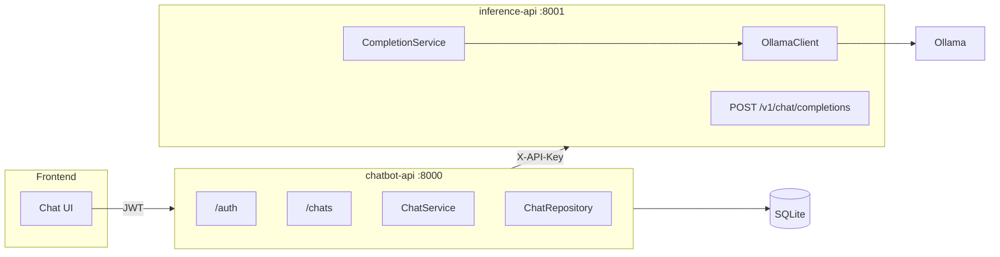

# Chat-LLM

Dois serviços FastAPI — **inference-api** (proxy OpenAI-like → Motor de inferência) e **chatbot-api** (usuários, chats, histórico).

## Arquitetura



### Autenticação

| Serviço | Quem chama | Mecanismo |
|---------|------------|-----------|
| **chatbot-api** | Frontend / usuário | `Authorization: Bearer <JWT>` após `POST /auth/login` |
| **inference-api** | chatbot-api (e scripts de lab) | `X-API-Key: <INFERENCE_API_KEY>` |

O frontend **não** deve receber nem enviar `INFERENCE_API_KEY`.

## Estrutura do repositório

```
chat-llm/
  inference-api/    # Inferência stateless
  chatbot-api/      # Auth, sessões, REST /chats
  docker-compose.yml
```

## Requisitos

- Python 3.11+
- [uv](https://docs.astral.sh/uv/)
- [Ollama](https://ollama.com/) em execução (para inference-api)

## Instalação

```bash
# inference-api
cd inference-api && uv sync --extra dev

# chatbot-api
cd ../chatbot-api && uv sync --extra dev
```

## Executar (desenvolvimento)

Terminal 1 — inference-api (porta **8001**):

```bash
cd inference-api
export INFERENCE_API_KEY=dev-inference-key
export LLM_BASE_URL=http://localhost:11434
uv run uvicorn main:app --reload --port 8001
```

Terminal 2 — chatbot-api (porta **8000**):

```bash
cd chatbot-api
export INFERENCE_BASE_URL=http://127.0.0.1:8001
export INFERENCE_API_KEY=dev-inference-key
export JWT_SECRET_KEY=secret
uv run uvicorn main:app --reload --port 8000
```

- Chatbot: http://127.0.0.1:8000/docs
- Inferência: http://127.0.0.1:8001/docs

Ou com Docker:

```bash
docker compose up --build
```

## Testes

```bash
cd inference-api && uv run pytest
cd ../chatbot-api && uv run pytest
```

## Variáveis de ambiente

### inference-api

| Variável | Descrição | Padrão |
|----------|-----------|--------|
| `LLM_BASE_URL` | URL do Ollama | `http://localhost:11434` |
| `LLM_TIMEOUT_SECONDS` | Timeout HTTP | `120` |
| `INFERENCE_API_KEY` | Chave exigida em `POST /v1/chat/completions` | `dev-inference-key` |

### chatbot-api

| Variável | Descrição | Padrão |
|----------|-----------|--------|
| `DATABASE_URL` | SQLite/Postgres | `sqlite:///./data/app.db` |
| `JWT_SECRET_KEY` | Assinatura JWT | `secret` |
| `JWT_EXPIRE_MINUTES` | Validade do token | `60` |
| `INFERENCE_BASE_URL` | URL da inference-api | `http://127.0.0.1:8001` |
| `INFERENCE_API_KEY` | Mesma chave da inference-api | `dev-inference-key` |

Limites de validação do payload (`CHAT_MAX_MESSAGES`, `CHAT_MAX_CONTENT_CHARS`) e o system prompt padrão estão como constantes em `chatbot-api/app/core/config.py`.

## Gerenciamento de contexto conversacional

O **chatbot-api** monta o prompt enviado à inference-api aplicando uma estratégia plugável em `app/chatbot_backend/context/`.
```python
# app/chatbot_backend/context/settings.py
CONTEXT_STRATEGY = "token_limit"  # sliding_window | token_limit | fixed_system | summarization
```

| Estratégia | Ideia | Constante no arquivo |
|------------|-------|----------------------|
| `sliding_window` | Últimas N mensagens | `WINDOW_SIZE = 6` em `sliding_window.py` |
| `token_limit` | Limite de tokens (proxy) | `MAX_TOKENS = 100` em `token_limit.py` |
| `fixed_system` | System fixo + histórico | `MAX_HISTORY = 4` em `fixed_system.py` |
| `summarization` | Resumo + mensagens recentes | `SUMMARY_THRESHOLD = 10` em `summarization.py` |

A resposta de `POST /chats/{id}/messages` inclui `context_window_size` e `context_strategy`.

## API do chatbot (frontend)

| Método | Rota | Auth |
|--------|------|------|
| `POST` | `/auth/register`, `/auth/login` | Público |
| `GET` | `/chats` | JWT |
| `POST` | `/chats` | JWT |
| `GET` | `/chats/{chat_id}` | JWT |
| `DELETE` | `/chats/{chat_id}` | JWT |
| `GET` | `/chats/{chat_id}/messages` | JWT |
| `POST` | `/chats/{chat_id}/messages` | JWT |

Fluxo típico: login → `POST /chats` → `POST /chats/{id}/messages` com o conteúdo da mensagem.

## API de inferência

| Método | Rota | Auth |
|--------|------|------|
| `GET` | `/health` | Público |
| `POST` | `/v1/chat/completions` | `X-API-Key` |

Contrato OpenAI-like puro (sem `session_id` / `channel`).
