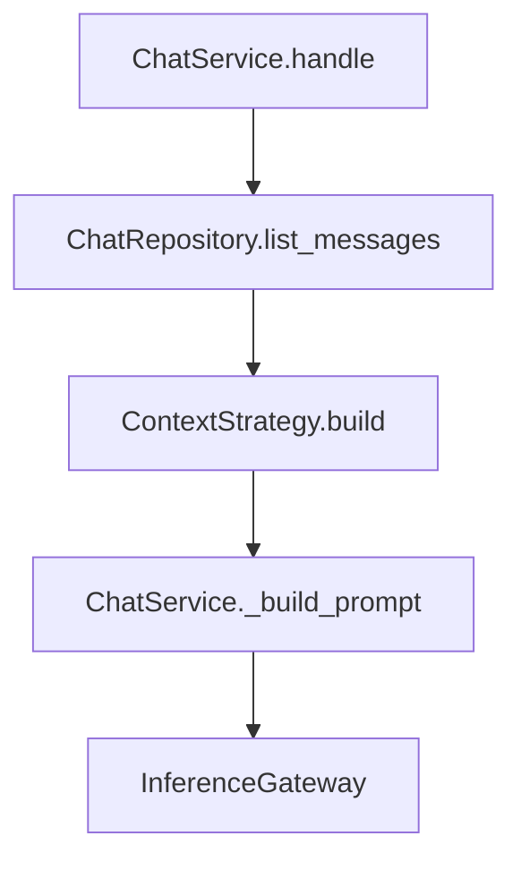

# Gerenciamento de contexto conversacional

## Pipeline



Arquivos:

| Estratégia | Arquivo no projeto |
|------------------|-------------------|
| Janela deslizante | `app/chatbot_backend/context/sliding_window.py` |
| Limite por tokens | `app/chatbot_backend/context/token_limit.py` |
| System fixo + histórico | `app/chatbot_backend/context/fixed_system.py` |
| Resumo de conversa | `app/chatbot_backend/context/summarization.py` |
| Estratégia ativa | `app/chatbot_backend/context/settings.py` |

## Trocar estratégia

```python
CONTEXT_STRATEGY = "sliding_window"  # token_limit | fixed_system | summarization
```

## 1. Janela deslizante (Sliding Window)

```python
WINDOW_SIZE = 6

def build_context(messages):
    return messages[-WINDOW_SIZE:]
```

**Prós:** simples, previsível. **Contras:** ignora tamanho real em tokens; mensagens antigas somem de uma vez.

## 2. Limite por tokens

```python
def count_tokens(text):
    return len(text.split())

MAX_TOKENS = 100

def build_context(messages):
    selected = []
    current_tokens = 0
    for msg in reversed(messages):
        tokens = count_tokens(msg["content"])
        if current_tokens + tokens > MAX_TOKENS:
            break
        selected.insert(0, msg)
        current_tokens += tokens
    return selected
```

A contagem por `split()` é um *proxy* didático — em produção deve-se utilizar o tokenizer do modelo.

## 3. System prompt fixo + histórico limitado

```python
MAX_HISTORY = 4

def build_context(messages):
    history = messages[-MAX_HISTORY:]
    return [
        {"role": "system", "content": SYSTEM_PROMPT},
        *history,
    ]
```

`ChatService._build_prompt` não injeta outro `system` quando `includes_system=True`. O request REST ainda pode enviar `system_prompt` para sobrescrever `SYSTEM_PROMPT` do arquivo.

## 4. Resumo de conversa (Conversation Summarization)

```python
def summarize(messages):
    texts = [m["content"] for m in messages]
    return "Resumo: " + " | ".join(texts[:4])

MAX_RECENT = 4

def build_context(messages):
    if len(messages) > 10:
        old_messages = messages[:-MAX_RECENT]
        summary = summarize(old_messages)
        recent_messages = messages[-MAX_RECENT:]
    else:
        recent_messages = messages
    # ... monta system com resumo + recent_messages
```

O resumo é persistido por sessão em `chat_sessions.conversation_summary`.

## Testes

```bash
cd chatbot-api && uv run pytest tests/context/ -q
```